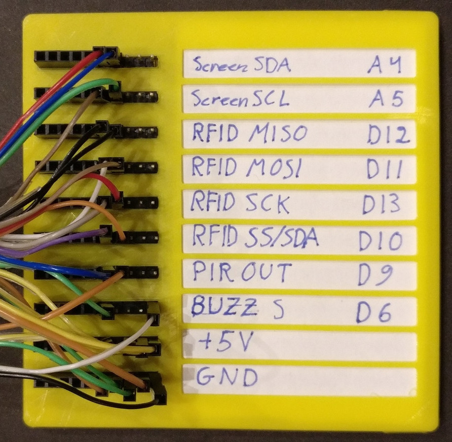
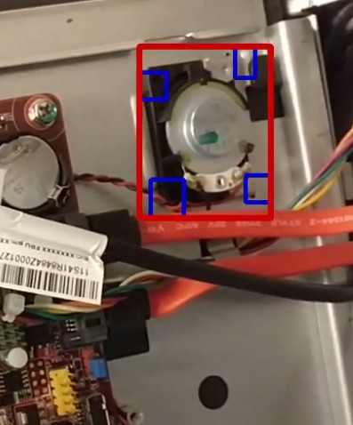
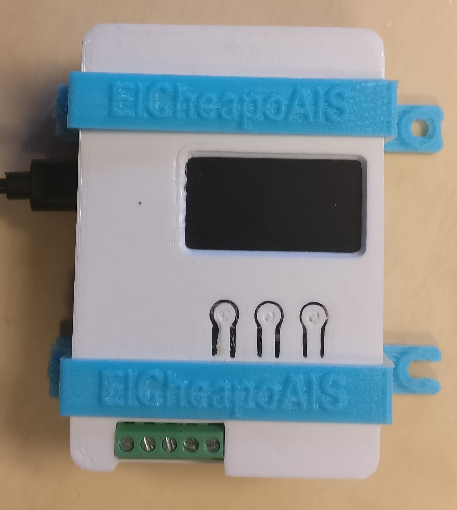

# Open Source projects @ Innovation garage AS

For our main website, see https://www.innovationgarage.no/

## Completed projects

### [TTyGO](https://innovationgarage.github.io/TTyGO/)
TTyGO turns an Arduino into a simple VT220 compatible serial terminal with some XTerm extensions with optional UTF-8 support. It uses the U8g2lib graphical library, so it is compatible with a lot of displays.

### [ProtoSwitchBoard](https://innovationgarage.github.io/ProtoSwitchBoard)
Does all your electronics prototypes end up looking like a snake nest? ProtoSwitchBoard is a labeled interconnect for your project designed to make your experimental prototypes as easy to follow as your circuit diagram!

### [label-V](https://innovationgarage.github.io/label-V)
A semi-automatic video labeling tool. Label-V uses the multi-tracking algorithm in OpenCV to generate training data for your computer vision project.

### [TinyTracker](https://github.com/innovationgarage/ElCheapoAIS-nmea)
TinyTracker (Formerly ElcheapoAIS) is a device that can be used to relay AIS messages from a ship, including its own position, speed etc to land using its regular (satellite) internet connection. Designed to be used together with GeoCloud on the server side, but can send the NMEA stream to any raw TCP port.

## Libraries

### [SakStig](https://innovationgarage.github.io/sakstig/)
SakStig is an object query and templating library any python object that supports the dict or list interfaces. The query language is compatible with the [objectpath](http://www.objectpath.org) query language.

### [GribUtils](https://github.com/innovationgarage/gributils)
Gributils is a set of utilities on top of pygrib for manipulating and indexing a large (historical) set of gribfiles.

### [Socket tentacles](https://github.com/innovationgarage/socket-tentacles)
Simple thread based tcp client/server that divorces the concept of server/client from which side opens the tcp connection. Configured using a simple dictionary structure that can be easily read from json.

## Prototypes / alpha versions

### [GeoCloud](https://innovationgarage.github.io/GeoCloud)
GeoCloud is a position tracking and track annotation system for ships, based on ElasticSearch and AIS data in NMEA format. It can download weather data in GRIB format and annotate positional data with meteorological data for the relevant place and time.

### [Cloudberry](https://innovationgarage.github.io/cloudberry/)
Documentation of, and a set of extensions on top of OpenWRT, OpenWISP and OpenVPN to implement network-to-docker-container-to-network routed vpn that supports both end-points being behind NAT and DHCP.

### [ElkProxy](https://innovationgarage.github.io/elkproxy/)
ElkProxy is a highly configurable proxy server that sits in front of an Elastic Search server and filters/rewrites searches, document downloads, uploads, and updates.

### [Price Tag Reader](https://github.com/innovationgarage/price-tag-reader)
Project to read supermarket price tags from photos to increase price transparency in the food market.

### [ChalkMail](https://github.com/innovationgarage/ChalkMail)
Write your email address on a white-board/table top at the end of a meeting to have a snapshot of the board sent to your inbox.

### [TFPrism](https://innovationgarage.github.io/tfprism/)
TFPrism is a library that transforms your tensorflow graph to automatically do data parallelism for training. All you need to do to modify your single-cpu tensorflow code to run on a cluster is to send your training op and feed_dict through the library.

### [Scramble](https://github.com/innovationgarage/Scramble)
Firefox scramble plugin for scrambing web pages. Nice to use for scrambling dashboards, monitoring data etc. where you don't want to accidentally leak customer or other private data.
